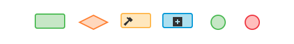

---
[System Architect exam blueprint](http://pearsonvue.com/pegasystems/csa7-2.pdf)

Exam:
90 mins 70 +3 Questions  
(65% needed to pass)

| Test domains                     | % of exam |
|----------------------------------|-----------|
| Application Design               | 7%        |
| [Case design](#case-design)      | 30%       |
| [Data model](#data-model-design) | 19%       |
| Decision Design                  | 7%        |
| [UI design](#ui)                 | 20%       |
| Report design                    | 7%        |
| Integration                      | 6%        |
| Testing                          | 4%        |
| Total                            | 100%      |

**Explore data model:** App -> _run a search on its name_ -> Data model -> Property

---

[Definitions](res/pega/definitions.md)

**Rules and classes**  
Pega uses the rules you create to generate application code.
Within the app rules are groupped in classes.  
Classes can contain rules or other classes.  
Each app has 3 types of classes:
- **work class:** contains rules that describe how to process a case or cases, such as processes, data elements, and user interfaces.  
- **integration class:** contains rules that describe how the app interacts with other systems
- **data class:** contains rules that describe the data objects

Pega provides two methods for inheriting rules: pattern inheritance and directed inheritance.

# <a name="case-design"/> Case design
- **Requirements management:** process of collecting, analyzing, refining, and prioritizing product requirements, and then planning for their delivery
- **Business objectives:** describe the business _value_ the application must provide, or the business needs the application must address
- **Requirements** -> describe what the app needs to do to meet business needs  
_(business terms, atomic, clear and concise, verifiable, consistent (no conflict between requirements))_
- **Specifications** -> describe steps needed to meet the requirements  
_(business terms, must be complete, does not change owner, can be implemented and tested)_

**Access:** Designer Studio -> Application -> Profile -> Requirements / Specifications

**Traceability** is the ability to link specifications back to business objectives and requirements, and forward to implementation artifacts, and test cases.


## Anatomy of a case

**Case -> Stages -> Processes -> Process steps**  
A case is work that delivers a business outcome.  
Stages are the first level of organizing within cases the different tasks, or processes required. Recommended number per case: _5-9_.   
Processes are the building block of stages, they define one or more paths the case must follow.  
A process contains a series of tasks, or steps. _3-7_

**Alternate stages**: stages that are not part of the normal case flow (eg. cancellation). Recommended number per case type: _3-5_.


# <a name="data-model-design"/> Data model design

The fundamental unit of the Pega data model — the element that stores the data — is called a property.

Property types:
- single value (eg. text, int, date etc.)
- collection of related values:
  - page (~ js class) .Customer.Name
  - list (~ js array) .Items(3)
  - group (~ js obj.) .Address(Work)

**Create** data type: Data explorer -> dropdown -> Add data type -> New / Existing Data Type

**Explore** data model: App -> _run a search on its name_ -> Data model -> Property

Exaple. **Data model** of a purchase request:


## <a name="data-transform"/> Data Transform
Data Transform is an option for copying and manipulating data.

**Creation:** App -> _right click a case_ -> +Create -> Data Transform  
_or_ click crosshair next to a Data transform input (eg.: at Work Parties)

**Usage:**
- Call from a flow action rule
- call from a connector
- [pyDefault](#data-transform-pyDefault)

### <a name="data-transform-pyDefault"/> pyDefault
pyDefault is called whenever a new case is created, and allows you to set default properties on creation.

### Declare Expressions

Most often used tool for making automated changes in Pega apps (like c = a + b). Declare expressions contains an **expression** a **source-** and a **traget property**.  

**Create:**  App explorer -> _expand case_ -> Property -> _right click property_ -> Define  expression  
**View**: App explorer -> _expand case_ -> Decision -> Define expression  
**Set recalculation** under Change Tracking tab.

Used in chain => declarative network

- forward chaining: recalculate, when the variables used in the calculation changes
- backward chaining: always recalculated, when referenced

### Declarative processing
Declarative processing maintains computational relationships among properties. When input values change, the declarative process automatically updates related property values.  

Declarative processing rules do not depend upon other rules, such as data transforms, activities, or user interface (UI) rules, to perform updates.
More info on declarative processing [here](https://pdn.pega.com/declaratives-decisions-and-validation-overview/declaratives-decisions-and-validation-overview)

### Procedural processing
Procedural processing depends upon rules, such as data transforms, activities, or user interface (UI) rules, to instruct the application when to look for a trigger event.

## Data propagation
Data propagation is the mechanism of **copying** data within the case hierarchy, which happens **on case creation**. If the data later changes on the parent page, it does not change on the child page. To use conditional logic to determine what to propagate, use a data transform.

Data propagation is not limited to subcases. Data can also be propagated when creating spin-off cases. For example, a purchase request case might spin off a supplier case if a new supplier is provided in the purchase request.

**Define**: Case explorer -> Settings -> Data propagation

## Data storage in Pega
Each data element is stored in memory on a **page**.  During case processing, each page remains in memory in a structure known as the **clipboard** (part of server memory reserved by Pega for the app data).

- User pages: contain data created due to user actions (pyWorkPage is part of it, contains data entered into forms)
- [Data pages](#data-pages): read-only data pages defined by data page rules
- Linked property pages: read-only pages created by linked properties
- System pages: contains pages about the current user session

### pyWorkPage
All the data generated as you create and process a case is stored on pyWorkPage. When you open a child case, the clipboard also contains the page pyWorkCover. pyWorkCover contains the case data for the parent case. This allows you to copy data between the parent case and the child case.


# <a name="process-design"/> Process Design

## Flow
 In Pega, a process is an instance of a flow rule. A flow models a business process in your application by using graphical shapes to define a sequence of events.

 **Acess:** Case explorer -> _select case_ -> _select process_ -> Open process

 **Standard shapes**


- assignment shape: task performed by a pearson
- decision shape: automates decision with decision logic
- utility shape: system action
  - smart shapes: preconfigured utilities (eg. Send Email)
- subprocess
- start / end shapes

**Draft mode**  
Flow rules created by the Case designer or Pega express are in draft mode by default. It allows to bypass the validation of the flow config during development (like referencing rules that do no exist yet).  
Flows with draft mode enabled cannot be run once the application is released.


## <a name="activity"/> Activity

An Activity is an automated procedure, structured as a series of steps that execute in sequence.

**Creation:** +Create -> Technical -> Activity  
**Adding to a process:**
Select process -> open process -> + -> Utility

**Method:** an operation that can be performed as a step of an activity  
_like: Propety-Set, Page-New, Page-Remove, Apply-Data-Transform, Call_

**Page context:**
- Primary page: provides data context for the whole Activity
- Step page: context (an individual data page) during execution of a specific step, if not defined, Primary page becomes the Step page
- Parameter page: contains activity parameters, which can be modified by the activity itself too

**Best Practice:**

look for standard options or out of the box activities where possible.  
Replacements:
- data manipulation: [Data Transforms](#data-transform)
- data calculations: Declare Expressions
- external DB query: Report Definitions

More info [here](https://pdn.pega.com/nine-tactics-reduce-your-need-custom-activities-prpc-62-sp2) on reducing need of custom activities

### Standard API activities:

**Access:** Designer Studio -> Processes and Rules -> APIs

## <a name="work-party"/>Work party
A Pega way of defining user groups and roles such as Customer or Manager.

 **Access:** App -> _select case type_ -> Process -> Work Parties -> pyCaseManagmentDefault  
 _or_ Case Designer -> _select a case_ -> Settings -> Parties

- addWorkObjectParty API activity: creates the work party automatically from existing case or session
- addParty flow action: allows users to add work party during an assignment
-

```
Party label: unique name
Role: auto populated from Party label, identifies the group on the clipboard
Party class: must be the Data-Party class or one of its descendants
 Party Prompt: additional label info to distinguish different parties
 Data transform: can be used to define initial values. The data transform must be in the party class or a parent class.
 VOE?: Visible on Entry if checked, the users are prompted to add this party every time a case is created
 Required?: if true, this work party must be present in every new case
```

 The role identifies the party on the clipboard. Each work party is a page within the WorkParty page group, and the role is used as the page index. For example, a work party with the role Customer is identified on the clipboard as **WorkParty(Customer)**.


## <a name="sla"/>SLAs

Advanced SLAs using rules: Case Designer -> _select a case_ -> _select assignment_ -> Goal & Deadline -> Use existing


Aviable config using SLA rules:

Assignment ready
- Immediately (default)
- Dinamically defined on Property: delay until specific time
- Timed delay: delay with specific amount of time

Calculate service levels
- Intervall from when assigment is ready
- Set to value of property

Service level definitions
- goal interval
- deadline interval
- passed deadline interval repeats (can be for a fixed amount of time or indefinitely until the user completes the assignment)

**.pxUrgencyAssign** records the urgency (sum of the following properties)  
**.pxUrgencyWork** contains the default urgency value (defaults to 10)  
**.pxUrgencyAssignSLA** urgency calculated from the service level rule (This value is the sum of the initial urgency and the urgency increments for the goal, deadline, and passed deadline intervals)   
**.pyUrgencyAssignAdjust** adds option for manual adjustments via actions

## Routing
Routing identifies who will work on an assignment as a case moves through a life cycle.

**Config:** Case Designer -> _select assigment_ -> General ->  Route to  
_or_ Flow Designer -> right click shape -> View properties -> Routing
_or_ Flow Designer -> + -> Smaret shapes -> approval process

**Worklist** is a list of all open assignments for specific users  
**Workbasket** when assignments are queued for a team of users, the assignments are stored in workbaskets. A team associated with a workbasket is called a _work group_.

- ToWorklist
- ToWorkbasket
- ToWorkGroupManager
- ToSkilledGroup
- ToDecisionTable
- ToDecisionTree activity

More on the default routers [here](https://pdn.pega.com/sites/pdn.pega.com/files/help_v72/procomhelpmain.htm#zstandardrules/rule-obj-activityforflows.htm?TocPath=Reference|Standard%2520rules%2520|Activity%2520rules|_____2).

## Corespondence
**Create:**  App -> right click class ->  +Create -> Process -> Correspondence

Use _Insert property_ to add properties (represented as <<.PropName>>)

Use _Insert Rule_ (far left in config) to include content in other rules such as paragraphs, segments, sections, whole Correspondence rules or fragments.

**Add:** Flow -> Utility -> use CorrNew activity  
_or_ Flow -> + -> Smart Shape -> Email  
_or_ Case designer -> Add step -> Utilities -> Send Email

Send mail manually: use SendCorrespondence local action

## Circumstancing rules
Circumstancing rules add possibility to make difference in the process based on specific variables (eg. adjusting the SLA based on costumer importance).

**Create:** Open base rule -> open dropdown @Save button -> Specialize by circumstance

Supported circumstancing conditions:
- Single value
- Multiple value: combination of values needs to be satisfied
- Date property
- As-of date: after a specified date, or during a specified range

Circumstance by Template:  
used for circumstancing by multiple conditions.  
Need to specify a template roule.

Circumstance by Property and Date:  
Property needs to be equal Value +

|Rule to be active if...                                      | Specifydate property | Specify start date | Specify enddate |
|------------------------------------------------------------|----------------------|--------------------|-----------------|
|  date value property within date range | **Yes**                  | **Yes**                | **Yes**             |
| date value property is after range    | **Yes**                  | **Yes**                | No              |
| it needs to be effective only within date range                | No                   | **Yes**                | **Yes**             |
| it needs to be effective after certain date                    | No                   | **Yes**                | No              |

**Switch** between circumstancing rules: App -> Goto Rule and expand  
_or_ Open rule -> Actions -> View Versions


# <a name="decision-design"/> Decision design

## Automated decision
- **business rules**: evaluate case data
  - **when** conditions --> if()
  - **map**: evaluates an 1 or 2d matrix, returns numeric or text res
  - **decision table**: evaluates all conditions in the row: if all true, return the result assigned to the row, else go to next row. If no rows true, returns a default result.
  - **decision tree**: evaluate each branch. If true, return result assigned to that branch, else check next branch.
- decision management rules: aviable in PegaDM apps

More info on Decision Management [here](https://pdn.pega.com/decision-management).

### Configuring when rules

**Create:** select process in Case Designer -> Start when  
_or_ +Create -> Decision -> When  
_to add more of them:_ click Actions

### Configuring decision tables and trees
Can be used in: flows, routers, activities, declare expressions.

**Create:** App -> _right click a class_ -> +Create -> Decision -> Decision table / tree


# <a name="ui"/> UI design
UI rules:
- **portal rule:** every UI is built inside one, they do not hold any visual elements
- **harness rules** are refereced do contet
- **section rule** is the form in which users work
- **control rules** are added to a section to help user interaction (eg. text boxs, dropdowns etc.)
- **layouts:** organize controls in a series of rows and columns

**Access** UI deign interface: App ->  _expand rule_ -> User Interface
- dynamic layout == resposive layout

## Dynamic layout properties

**Visible when conditions**:
- _Always_
- if _not blank_ _not zero_
- bool condition
- when rule

**Action sets**
- **Event** — A trigger performed by the user, such as clicking a button, hovering a mouse pointer over a field, or entering a value in a grid
- **Action** — A response performed by the system as a result of the user event (for example, when the user clicks a button, a case is created.)
- **Conditions** — Restrictions such as when rules, which can be applied to an event and action combination (for example, you can configure conditions so that hovering over a field displays a smart tip message only if the field contains a property value.)

## Data validation
- **Required fields**
- **Editable settings** -> verify patterns, formats
- **Control types** -> verify values

**Create:** App -> _right click case_ -> Create -> Process -> Validate  
**Associate with flow action:** flow diagram -> open flow action -> Validation tab -> set validation criteria

## Reports
Data is displayed in columns, you cannot display a page in a column (you can return specific properties on the page, but not the entire page)

**Create:** App explorer -> _select class_ -> Create -> Reports -> Report Definition  
Main steps: create report definition rule, add columns, add filters

Organizing results: summarize (aggregate), visual summary, group results, sort values

### Optimizing data reports
Pega stores cases in a relational db as blobs. By defualt these properties get dedicated columns in the db: case creation date, status and ID. Embedded properties are exposed in a different table, rather than the table that contains the BLOB. This allows Pega to establish a separate content for each exposed embedded property.

**Optimize property:** App explorer -> _expand a class_ -> Data model -> Properties -> _right click on a prop you want to optimize_ -> Optimize for reporitng   

Optimization launches a **background task**, which may take a long time to finish. To **view** background tasks: Designer Studio -> System -> Database -> Column Population Jobs

## <a name="data-pages"/> Data pages
Data pages are used to retrieve data for your application, rega srdless of the source.
The data page loads the data into memory (stored in the clipboard), so it is accessible for subsequent access.

**Create:** Data explorer -> _right click data type_ -> Add data page

- scope: defines who can access the data page
  - thread: used when the data page is context-sensitive to a particular case
  - requestor: allows to share data for a given (user) session
  - node: accessible to all users of the app on the same node
- refresh strategy: defines, when the data is considered stale (the page is only reloaded if referenced)
- structure: page or list (page for single record, lsit for multiple)
- source:
  - Connector: for getting data from external source
  - [Data transform](#data-transform)
  - Report dedfinition: used to return a list of data objects mapped in the application
  - Look-up: used to return a specific data object mapped in the application.
  - Load [activity](#activity): special situations, where other options are not suitable

## Reference data
Reference data defines permissible values for data fields.  
_Reference data should be distinguished from master data. Master data represents key business entities, such as customers. Master data contains all the necessary detail — for example, an identifier, name, address, and date of account creation for a customer. Reference data consists of a list of permissible options with relevant metadata._

### Local data storage
Allows you to store reference (external) data as part of the application.

**Create:** Data explorer -> _select data type_ -> Sources -> Create a local source  
_The first screen displays the properties that are already available in the selected data type._

## Connectors
Connectors help integration between systems. You can parse, convert, and map data in either direction to or from the clipboard. Connectors can be ionvoked from data pages and activities.

Steps to invoke a connector:
- (use data transforms to set request data)
  - Initialize connector
  - Map outbound data
  - Invoke Service (request out, response in)-
  - Map Inbound data
  - Finalize Connector
- (use data transform to map response data)

**Create (wizzard):** Designer studion -> Integration-> Connectors  
wizzard process: 1) upload service metadata, 2) configure integration specifics, 3) select methods, 4) generate records

Included standard connectors: SOAP, REST, SAP, EJB, JMS, MQ, File, and CMIS

## Services
Services are activities, that allow to expose data and functionality from Pega apps.

## Testing
- Live UI
- Tracer
- Clipboard
